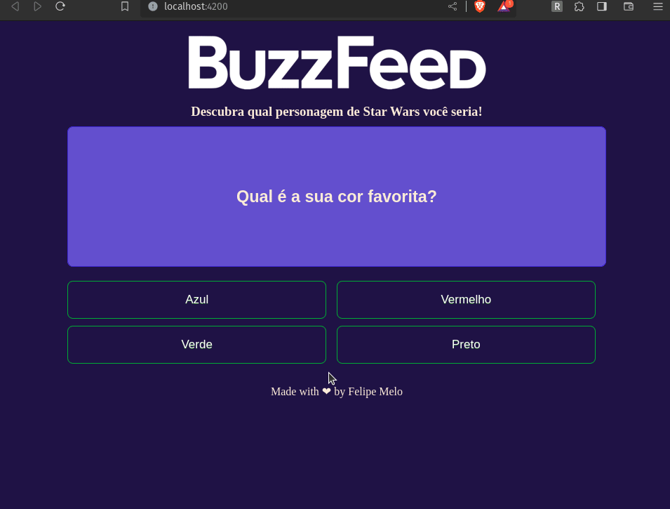

<p align="center">
  <a href="#-tecnologias">Tecnologias</a>&nbsp;&nbsp;&nbsp;|&nbsp;&nbsp;&nbsp;
  <a href="#-projeto">Projeto</a>&nbsp;&nbsp;&nbsp;|&nbsp;&nbsp;&nbsp;
  <a href="#memo-licença">Licença</a>
</p>

<p align="center">
 

  
</p>

<br>

<p align="center">
  
</p>

## 🚀 Tecnologias

Esse projeto foi desenvolvido com as seguintes tecnologias:

- HTML
- CSS
- Typescript
- Angular
- Node
- Netlify

## 💻 Projeto

Esse projeto foi proposto como um desafio de frontend durante o Bootcamp de frontend com angular promovido pelo banco PAN em parceria com a plataforma DIO.

Esse desafio buscou propor a homepage de um site de blog, os dados até o momento são fixos, e utilizei pela temática de Star wars.

Foi feito o deploy do site desenvolvido utilizando a plataforma Netlify, você pode acessar através [desse link](https://fabulous-sopapillas-f97f96.netlify.app/)

## 👨‍💻 Como-rodar-o-projeto

Você precisa ter o <strong>Node.js</strong> instalado na sua máquina. Senão tiver você pode fazer o download através [desse link](https://nodejs.org/en/download/).
Depois você vai instalar o Angular CLI. Instala-se ele usando esse comando 
```npm install -g @angular/cli```
Com o Node e Angular instalado na máquina, vc precisa apenas de 2 comandos (no terminal) na pasta do projeto, nessa ordem:
1. `npm install` -> Para instalar as dependências do projeto. (só precisa ser executado uma vez)<br>
2. `ng serve` -> Para iniciar o servidor local (para acessar o projeto via navegador, digite na barra de endereço o endereço que aparecerá no terminal)<br>


## :memo: Licença

Esse projeto está sob a licença MIT. Veja o arquivo [LICENSE](LICENSE) para mais detalhes.

---

Feito com ♥ by Felipe Melo
